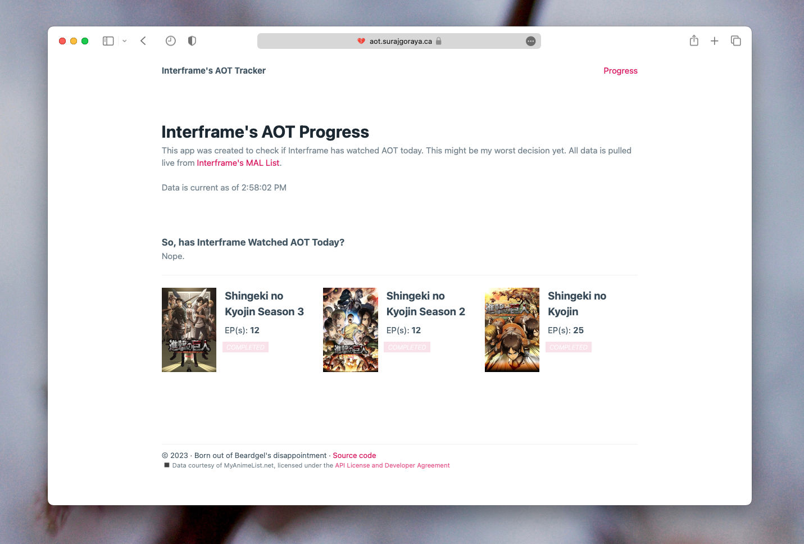

# aot-tracker
A small web app which monitors if I've watched [*Attack on Titan (AOT)*](https://myanimelist.net/anime/16498/Shingeki_no_Kyojin) recently, via monitoring my [MyAnimeList](https://myanimelist.net/profile/interframe).

## Screenshot

## Why?
I'm disappointing my friends by procrastinating watching Attack on Titan. To help them stop checking my list everyday, I wanted to make them a handy little app that does it for them! (And an API too!!) 

## Where?
The app is hosted on a Vercel instance, and is live at: https://aot.surajgoraya.ca